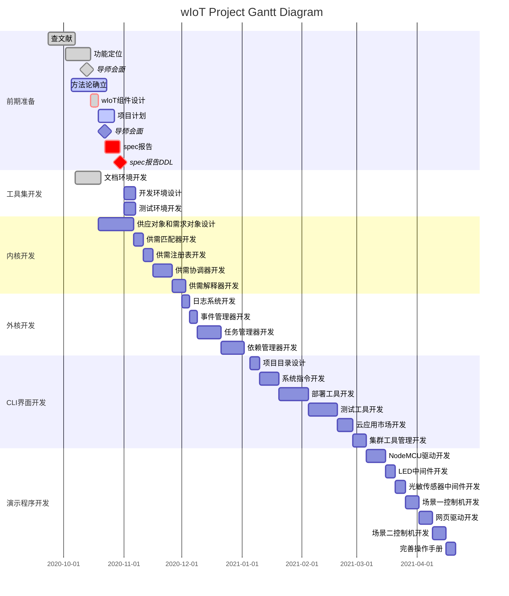

## 思想

在人类社会中，每个人都是独立的个体，拥有自己需要的东西和擅长的技能（需求和供应）。但是，单靠自己的生产（供应）很难满足自己的所有需求，于是人们开始相互交换物品，以实现供需平衡。

在物体世界中，类似人类，每个事物也会具有自己独特的供应和需求。但是，由于事物不具备主动性，因此事物间难以自发性地产生交换以实现供需平衡。

但是，在物联网时代，这一切将会被改变。物联网的目标是让物体变得更智能，更像人类。人类社会中的一些现象，比如市场，也将会以相似的形式出现在物体世界中。物“联网”的实现，使得物体之间能够轻易的产生交互。而物体的主动性（人类施加在物体上的期盼与意志），将推动物体之间产生交互，从而实现供需平衡。

## 定位

wIoT的定位，是物体世界的市场。正如同人类世界中的超市，人们可以把自己的“供应”摆到超市的货架上，有需求的人（客户）则能够在逛超市时找到货架上最能满足自己“需求”的“供应”。在物联网世界中，“物体们”将自己的“供应”摆在wIoT里，而有“需求”的“物体们”则能够在wIoT找到最满足自己“需求”的“供应”。

在wIoT世界观中，所有的事物(thing)都由供(supply)需(demand)描述。wIoT的实质，是运行在网络边缘高性能计算节点上的供需协调器。wIoT存在以下运行场景：

### 星型结构


wIoT部署在网络边缘计算资源丰富的地方，比如计算性能强大的网关或路由器附近。网络边缘的各种传感器、控制器、用户终端等设备，网络中心的云服务等，都通过各自的方式接入到wIoT上。wIoT则负责将这些各种各样的接入设备按需相互连接。

#### 物体接入

以图中的LoRa Sensor为例，假设存在一个WiFi路由器实现的局域网络。存在一个LoRa网关接入此WiFi网络，且存在一个树莓派接入此WiFi网络。如下图。


假设在树莓派上，运行着一个wIoT内核。那么如何将传感器接入wIoT系统呢？此时，需要工程师使用自己的手段，使传感器的数据（比如风速）能够实时传递到树莓派上（比如封装成一个函数，一调用就会返回实时的风速数据）。然后，在树莓派上，按照wIoT手册中的规范和接口，将风速这一“供应”绑定到wIoT内核上。

#### 物体间交互

假设在上述场景中，还存在一个无人机。这个无人机也以某种方式与树莓派建立了通信，并接入了wIoT内核。由于某种原因，这个无人机需要在某刻获取此地风速信息。此时，无人机会将“风速”这一需求绑定到wIoT内核上。wIoT内核会查找已经绑定在内核上的“供应”，从而发现LoRa Sensor可以满足此无人机的需求。

在wIoT内核的协调下，无人机能够与传感器交互并获取最新的风速信息。

如果有多个传感器提供“风速”这一供应，wIoT将根据无人机的“需求”找到最佳匹配。

除了传统的传感器等物体，像虚拟的云服务等也可以将自己的供应绑定在wIoT内核上。例如，中国气象网上提供的风速接口API等。


### 网状结构


如上图所示，由于wIoT的设计特性，各个wIoT系统之间可以很轻易地通过网状结构相互连接，从而实现跨区域的供需调度和平衡。这就好比从前各个国家互相之间相互隔绝，有各自互不想通的市场体系。国家A擅长制造椅子，国家B擅长制造桌子。国家A的居民只能使用自己国家制造的比较劣质的桌子，而国家B的人则只能使用自己国家制造的比较劣质的椅子。有一天，这两个国家的市场相互连通起来，于是国家A的人用上了更好的桌子，国家B的人用上了更好的椅子。


网状结构的wIoT们能够为每个“物体”的“需求”找到区域中（不仅仅是本地）最匹配的“供应”。

!> 考虑到预留裕度，FYP计划中仅实现简单的星型结构


### FYP目标

wIoT项目的意图较为宏大，且好多设计的可用性尚不清晰。在FYP阶段，我计划打造一个原型，将wIoT的理论作一个简单的实现，以证实wIoT的理论确实有一定的实用价值。

**FYP的目标是打造一个面向供需的IoT操作系统原型**

#### 平台、语言与环境

FYP阶段，我将使用NodeJS作为wIoT核心系统的实现环境，使用TypeScript和JavaScript作为核心系统的开发语言。使用NodeJS的命令行接口打造wIoT-CLI命令行程序。

为了便于开发、测试和运维，wIoT的核心系统将运行在CentOS7的官方Docker容器中，从而排除操作系统对其可能产生的影响。

在最终的测试和展示中，我会使用在之前阶段搭建好的wIoT，根据之前编写好的使用手册，搭建一些简单的物联网场景，来**验证**wIoT的可用性甚至是优势。在此阶段，我可能会使用NodeMCU，Arduino Nano，Arduino Uno，树莓派，智能手机，LED，传感器等。这一阶段可能会使用C\C++，Lua，PHP，Python，Go，SQL等语言。

## 系统设计

wIoT系统主要分为两部分：wIoT核心系统，wIoT-CLI命令行界面。

### wIoT核心系统

wIoT核心系统包含内核和外核两部分。

#### wIoT内核-供需管理器

wIoT内核的实质是一个供需管理器。wIoT内核的功能是接受“供应”和“需求”的注册，并动态返回“需求”的最佳匹配“供应”。wIoT内核提供“供应”注册，“供应”销毁，“需求”注册，“需求”销毁，注册表查询 等接口。


?> 本结构仅供参考，最终设计以开发结果为准（敏捷开发）

wIoT内核由供需解释器，供应注册表，需求注册表，供需协调器和供需匹配器组成。

供需解释器将wIoT外核传入的“供应描述”和“需求描述”转换为需求协调器能够识别的格式，并储存到相应的“供应注册表”和“需求注册表”中。

供应注册表和需求注册表负责记录“供应”，“需求”以及“供需关系”。

供需协调器能够调用供需匹配器对注册表中所有“供应”和“需求”的匹配度进行计算，并在最佳匹配的“供应”和“需求”之间建立“供需关系”，并存入“供需关系”链。供需协调器还将实时侦听注册表的变动，并在注册表变动时刷新生成“供需关系”链。

供需匹配器接受一个“供应”和一个“需求”，并返回一个匹配度。

#### wIoT外核

作为一个操作系统，wIoT的目标是将各种设备（硬件）接口进行虚拟化，从而允许开发者在不了解设备（硬件）的情况下调用系统提供的接口进行编程。比如，在win操作系统中，我们可以轻松编写程序在屏幕上绘制一幅画，而无需考虑显示屏型号，显示屏是如何被操作的等。然而，仅仅依靠内核-供需管理器的功能，难以实现以上功能。为了让wIoT更像一个操作系统，我们引入了wIoT外核。

为了让开发者能够轻松在wIoT系统上进行开发，wIoT核心将提供一系列面向“程序”的接口。开发者可以在NodeJS环境中，调用这些接口编写wIoT程序。


如上图所示，wIoT程序能够向wIoT提出“需求”，提出“供应”，还能够使用NodeJS编程与设备硬件交互。

如果一个wIoT程序仅仅“与设备相连”、提出“供应”，而没有提出“需求”，我们认为这个程序是一个驱动。

如果一个wIoT程序仅仅提出“需求”，而没有提出“供应”以及“与设备相连”，我们认为这个程序是一个“控制机”。这种程序将能够实现一些智能控制的逻辑，比如“天黑灯亮”等。这种程序具备很强的可移植性。

如果一个wIoT程序仅仅提出“需求”和“供应”，我们认为这个程序是一个“中间件”。通过“中间件”，我们能够更加有效地实现我们想要的物联网功能。比如，你想编写一个程序实现摄像头“发现有人”，则“灯亮”。你已经将“摄像头”和“灯”接入了wIoT系统，但是你不想再费力开发一个图像识别功能，因为这不是你的专长。于是你可以从wIoT应用市场中，发现有一个“图像识别”的“中间件”。你只需要下载运行这个“中间件”，然后在你的程序中调用中间件提供的“识别结果”这一供应即可。


综上，程序的工作是，通过向wIoT内核提交“需求”，获取“供应”的使用权，从而使用各种“供应”进行编程。以人体为例打个比方，眼睛这一设备提供“视觉”这一“供应”，腿提供“跑”这一“供应”。依赖“视觉神经”和“运动神经”这两个“驱动”，大脑能够看见“视觉”并能够控制腿去“跑”。在大脑中，运行着一些习惯（控制机）。其中一个习惯（控制机）是，当通过“视觉”看见“狼”，就“跑”。

为了实现以上功能，我设计了以下外核架构。


?> 本结构仅供参考，最终设计以开发结果为准（敏捷开发）


wIoT外核位于wIoT内核外部，由依赖管理器，任务管理器，事件管理器，日志系统组成。

依赖管理器负责在程序或驱动启动时检查其所需要的依赖（供应）是否具备。如果不具备，则报错并终止此程序或驱动的启动。

当程序启动成功后，进程将由任务管理器进行管理。

事件管理器负责处理内核和外核产生的各种事件，并根据事件类型进行各种操作，比如警告、报错、重启等。

日志系统负责记录系统发生的各种事件。

### wIoT-CLI命令行

wIoT-CLI命令行界面是运行在用户终端上的一套操作界面。通过此界面，用户可以实现对远程wIoT系统的操作。

#### 一些CIL命令

 - `wiot help [command]`: 获取帮助信息
 - `wiot version`: 获取版本信息


## 使用方法

### wIoT核心系统

 - 在需要部署wIoT核心的电脑操作系统上安装Docker环境
 - 使用指令`docker run -d --name=wiot -p 3594:3594 -v /var/log/wiot/:/var/log/wiot/ iotcat/wiot`部署wIoT核心

### wIoT命令行界面

 - 在个人电脑上安装NodeJS环境
 - 使用指令`npm i -g wiot-cli`安装wIoT命令行界面
 - 使用指令`wiot init <folderName> <IP Address>`在当前目录新建并配置一个wiot项目文件夹，以方便控制远程wIoT核心。
 - 进入项目文件夹，使用指令`wiot status`查看远程wIoT核心状态
 - 运行指令`wiot driver search`查看并下载需要的驱动文件。你也可以自己编写驱动文件。
 - 运行指令`wiot search`查看并下载需要的程序文件。你也可以编写自己的程序文件。
 - 运行指令`wiot run <programFile>`在远程运行一个程序
 - 运行指令`wiot ps`查看所有正在运行的程序
 - 运行指令`wiot kill <pid>`终止远程正在运行的程序
 - 在项目文件夹的`wiot.config`文件中配置需要开机自启的程序。默认状态下，所有的驱动都是开机自启的。


## 测试场景


### 静态物联场景


此场景用于验证wIoT能够实现最简单的物联网场景。如上图所示，wIoT核心运行在树莓派上，树莓派和两个NodeMCU开发板连接到同一个WiFi路由器。一个光敏传感器和一个LED分别连接至两个NodeMCU上。

在按照wIoT使用手册将光敏传感器和LED接入到wIoT，通过在wIoT上编程，实现：若光敏传感器暗，LED亮；若光敏传感器亮，LED灭。


#### 鲁棒性测试

在以上场景中，加入另外两个与之前完全一致的光敏传感器+NodeMCU如下图。


在wIoT上，将这两个光敏传感器注册为与之前一个完全一样的“供应”。

此时，遮挡某一个光敏传感器，LED不发生变化。（因为是少数，wIoT会认为这个光敏传感器出错了）

同时遮挡两个以上的任意光敏传感器，LED亮。

任意拔掉两个带光敏传感器的NodeMCU电源，剩下的一个光敏暗->LED亮；光敏亮->LED暗。


### 客制化物联场景

在以上场景的基础上，按照wIoT使用手册的方法，接入一个网页。


如上图，演示时，用户能够使用自己的手机扫描二维码打开网页。在网页上，用户将能够选择自己喜欢的LED参数，比如亮度，怎么亮（呼吸灯），甚至可以从页面上提交一个JavaScript函数来实现自己的个性化LED照明。

由于仅有一个LED，且演示场景难以部署室内定位等设备，因此页面被简单地设计为互斥型。当有新的手机扫描二维码时，旧手机将被登出。LED将按照最近扫描二维码的指示进行演示。


### 车联网场景（不写在Spec中）

本场景将模拟车联网场景下车与车，车与环境间的交互。


如上图所示，三个树莓派分别模拟车辆A，车辆B和环境。树莓派上接的光敏传感器模拟车辆和环境中的各种传感器。树莓派上LED模拟车辆和环境的反映。在此场景中，任何一个车辆的光敏暗，则所有树莓派上的LED亮。

分别在三个树莓派上部署wIoT核心系统。并分别按照wIoT使用手册将光敏传感器和LED接入到各自的wIoT中。

验证，任何一个树莓派的光敏暗，所有树莓派LED亮。

将任意一个树莓派移除WiFi范围。遮挡移出的树莓派光敏，只有这个树莓派的LED亮。遮挡未移出的任意一个树莓派的光敏，未移出的所有树莓派LED亮。

将移出的树莓派移动回来，遮挡任意一个树莓派的光敏，所有树莓派LED亮。

## Spec

### work package 1: 前期准备

?> 请点击下方**S M A R T**字母进行切换
!> 微信内置浏览器**可能**无法正确显示以下内容，请使用其它浏览器浏览！！

<!-- tabs:start -->

<!-- tab:S -->

**1.1 查文献**

调查**操作系统设计**以及**分布式系统设计**相关资源以及文献，从他人的设计中获取灵感，总结经验。

**1.2 功能定位**

寻找一个适合wIoT的定位，这个定位应当时符合我个人职业规划的，也应尽可能是符合历史趋势的。


**1.3 方法论确立**

根据以往项目经验，以及查询的文献，确立FYP项目使用的方法论。

**1.4 wIoT组件设计**


前面几各流程研究的都是宏观的，抽象的。而这一部分的目标，找一个落地方案，根据前面的研究结果对系统进行一个初步的设计，以方便后期管理项目进度。

一般来讲，这一部分将对wIoT系统按照运行环境、功能等进行分割，并对分割出的各组件进行初步设计。

**1.5 项目计划**

这一部分的目标是对各组件的开发难度进行预测，并制定一个较宽裕的时间表。

<!-- tab:M -->

**1.1 查文献**

- [x] 对各主流物联网操作系统建立较为深刻的认识
  - [x] 理解各系统提出的背景和这个系统解决的行业痛点
  - [x] 能够能够指出它们的优势和劣势
- [x] 能够指出当前物联网行业的困境和需求

**1.2 功能定位**

- [x] 确立wIoT所要实现的功能
  - [x] 这个功能是否符合当前或未来行业的需求
  - [x] 开发这个功能所锻炼的技能是否符合我的职业规划

**1.3 方法论确立**

- [x] 确立系统设计思想
  - [x] 是否清晰简洁
  - [x] 是否能够简化设计思维

- [x] 确立项目开发思想
  - [x] 是否在某些方面有助于项目开发
  - [ ] 是否可实施，具备可实施条件

**1.4 wIoT组件设计**

- [x] 各组件是否界限清晰，功能是否明确
- [x] 是否可实施，没有明显的不可逾越的技术困难
- [ ] 各组件设计是否简洁，是否有多余的设计
- [x] 是否提出对于各组件测试（展示）场景的描述
- [x] 是否对开发语言，使用的平台、工具等进行阐述

**1.5 项目计划**

- [ ] 是否清晰明确
- [ ] 是否足够宽裕，能够容错
- [ ] 是否与课程结合（比如spec报告，presentation等时间节点）
- [ ] 是否有助于健康


<!-- tab:A -->

基本的工具如电脑和环境具备，在身体健康，没有大规模不可抗事件发生的情况下，预计能够完成。

<!-- tab:R -->

**1.1 查文献**

非常必要。要站在巨人的肩膀上才能走的更远。

**1.2 功能定位**

非常必要。前期定位不准确，后期开发大概率会混乱掉，南辕北辙。


**1.3 方法论确立**

必要。指导思想和方法论能够使得设计和开发思路更加清晰单纯，进而产出更加可靠的结果。

**1.4 wIoT组件设计**

非常必要。尽管我预期使用的是敏捷开发的模式，但在项目最初阶段对项目骨架进行思考具备非常重要的领航意义。并且能够方便项目管理。

**1.5 项目计划**

非常必要。能够方便与导师沟通，明确各阶段的工作目标，使工作更加有动力。对项目的运行起到把控作用。

<!-- tab:T -->

考虑到“完事开头难”等特性，结合课程时间节点，此阶段将持续3周。


<!-- tabs:end -->


!> 请回到上方点击**S M A R T**字母进行切换


### work package 2: 工具集开发


<!-- tabs:start -->

<!-- tab:S -->

**2.1 文档环境开发**

开发一套在线的文档系统，用于记录日志，spec，使用手册等信息。

**2.2 开发环境设计**

此步骤将准备开发环境，比如Git Flow的初始化，VSCode的一些基本配置，开发目录的设计等。


**2.3 测试环境开发**

根据`1.4 wIoT组件设计`中提到的测试（展示）场景，开发一系列用于测试各组件的工具。


<!-- tab:M -->

**2.1 文档环境开发**

- [ ] 文档系统是否易于使用/变更
- [ ] 文档系统是否易于访问

**2.2 开发环境设计**

- [ ] 能否提高开发效率
  - [ ] 开发环境是否分档清晰
  - [ ] 历史代码是否便于找回
  - [ ] 是否能够便捷地管理Todo
  - [ ] 是否能够便捷地管理Issue
  - [ ] 开发环境是否一次配置，多设备部署（比如电脑坏了，无需重新配置）
- [ ] 是否便于与他人分享（社区）


**2.3 测试环境开发**

- [ ] 能否满足内核测试需求
  - [ ] 供需匹配器测试需求
  - [ ] 
- [ ] 能否满足外核测试需求
- [ ] 测试设计是否全面
- [ ] 日志是否丰富详细


<!-- tab:A -->

所需工具如电脑等都具备。我之前有一定的开发环境设计配置经验，这一部分预计难度不是很大，但需要注重细节。

<!-- tab:R -->

**2.1 文档环境开发**

必要。没有文档，开发就没有纲领。没有好用的文档系统，用户难以了解我的设计，一些平时的想法也难以记录下来。

**2.2 开发环境设计**

必要。磨刀不费砍柴工。好的开发环境能够使开发效率极大提高。


**2.3 测试环境开发**

必要。在面向测试的开发过程中，每个组件都应当在开发过程中进行全面的测试以获得反馈。由于我是由内向外开发，内核和外核的开发过程较为抽象，如果直接使用展示场景测试将难以实施，且发现问题后查错也不方便。因此，完善的测试环境对于这个项目是非常必要的。

<!-- tab:T -->

此阶段大约持续一周时间。

<!-- tabs:end -->


!> 请回到上方点击**S M A R T**字母进行切换


### work package 3: 内核开发


<!-- tabs:start -->

<!-- tab:S -->

**3.1 供应对象和需求对象设计**

设计供应对象和需求对象来描述程序的“供应”和“需求”。

供应对象应包含以下内容：
 - 对父程序信息的记录
 - 能够主动联系父程序
 - 能够判断父程序是否存活
 - 供应内容的使用方法（函数）
 - 存在某种标识，用于匹配度计算
 - 对供应关系的记录

需求对象应包含以下内容：
 - 对父程序信息的记录
 - 能够主动联系父程序
 - 能够主动判断父程序是否存活
 - 对需求的描述，用于匹配度计算
 - 对供应关系的记录


**3.2 供需匹配器开发**

使用TypeScript/JavaScript开发一个供需匹配器，接受一个“供应”和一个“需求”，返回匹配值。

> `(Obj supply, Obj demand) => number matchRate`

**3.3 供需注册表开发**

使用TS/JS开发一个供需注册表。这个注册表能够存储多个“供应”，“需求”，以及“供需关系”。


?> 注： `sid`指`supply id`, `did`指`demand id`

面向供需解释器的接口：

> - 供应注册`(Obj supply) => number sid`
> - 供应注销`(number sid) => number statusCode`
> - 需求注册`(Obj demand) => number did`
> - 需求注销`(number did) => number statusCode`
> - 列举供应`(Obj condition) => array demandList`
> - 列举需求`(Obj condition) => array supplyList`

面向供需协调器的接口：

> - 提取供应`(sid) => Obj supply`
> - 提取需求`(did) => Obj demand`
> - 列举供应`(Obj condition) => array demandList`
> - 列举需求`(Obj condition) => array supplyList`
> - 新建供需关系`(sid, did) => number statusCode`
> - 销毁供需关系`(sid, did) => number statusCode`


**3.4 供需协调器开发**

供需协调器通过供需注册表的接口以及供需匹配器的接口，对供应和需求进行动态匹配。供需协调器将在注册表变化后被唤起。


**3.5 供需解释器开发**

供需解释器的主要作用是对输入的“供应”和“需求”进行格式化和筛选，对非法的和重复的请求进行拒绝，从而保护注册表的纯洁性，防止内核崩溃。

面向外核的接口：

> - 供应注册`(Obj supply) => number statusCode, number sid `
> - 供应销毁`(number sid) => number statusCode`
> - 需求注册`(Obj demand) => number statusCode, number did`
> - 需求销毁`(number did) => number statusCode`
> - 列举供应`(Obj condition) => array demandList`
> - 列举需求`(Obj condition) => array supplyList`
> - 列举供需关系`(Obj condition) => array supplyDemandRelationList`


<!-- tab:M -->

**3.1 供应对象和需求对象设计**

- [ ] 供应对象满足以下需求
  - [ ] 对父程序信息的记录
  - [ ] 能够主动联系父程序
  - [ ] 能够判断父程序是否存活
  - [ ] 供应内容的使用方法（函数）
  - [ ] 存在某种标识，用于匹配度计算
  - [ ] 对供应关系的记录

- [ ] 需求对象满足以下需求：
  - [ ] 对父程序信息的记录
  - [ ] 能够主动联系父程序
  - [ ] 能够主动判断父程序是否存活
  - [ ] 对需求的描述，用于匹配度计算
  - [ ] 对供应关系的记录


**3.2 供需匹配器开发**

- [ ] 实现供需匹配功能
- [ ] 高度可靠
- [ ] 匹配效率可观

**3.3 供需注册表开发**

 - [ ] 能够满足供应注册注销功能
 - [ ] 能够满足需求注册注销功能
 - [ ] 能够按需提取供应需求
 - [ ] 能够记录（管理）供需关系
 - [ ] 能够在一定程度上自我排错

**3.4 供需协调器开发**

 - [ ] 能够对需求的最佳供应进行排序
 - [ ] 可靠性较强
 - [ ] 效率可观

**3.5 供需解释器开发**

 - [ ] 能够阻止非法请求
 - [ ] 能够阻止重复请求
 - [ ] 能够对不规范的请求进行格式化


<!-- tab:A -->

这一阶段尤其是`3.1 供应对象和需求对象设计`是整个项目的重心，很有挑战性。但只要测试工具箱等有利环境备齐，这一阶段预计将能顺利进行。

<!-- tab:R -->


**3.1 供应对象和需求对象设计**

非常必要。没有规矩不成方圆。这一阶段确立一个“规范”，大家都来遵守，进而才能实现万物互联。


**3.2 供需匹配器开发**

非常必要。这是系统功能最核心的部分。其性能高低直接决定了整体系统的效率。

**3.3 供需注册表开发**

非常必要。注册表使得供应和需求对象以及供需关系更加易于管理。

**3.4 供需协调器开发**

非常必要。在这一阶段将实现wIoT供需协调功能的实现，是wIoT系统的大部分意义所在。

**3.5 供需解释器开发**

必要。过滤掉非法和重复的请求，减轻核心系统的负担，让核心系统可以专注于实现供需协调。


<!-- tab:T -->

此阶段预计需要一个月。详见甘特图。


<!-- tabs:end -->


!> 请回到上方点击**S M A R T**字母进行切换


当前想法：

供应对象：

```js
{
  sid: 2
  father: {
  	type: 'driver',
  	pid: 32,
  	heartbeat: function(){
  		// 检查父驱动是否存活
  		return ((yes)?true:false);
  	}
  },
  product: {
  	type: 'light',
  	features: {
  	  luminance: {
  	  	input: {
  	  	  type: ['number', 'boolen'], //input支持的类型
  	  	  reg: function(n){ //用于对input进行补充描述
  	  	  	if(typeof n == "boolen" || typeof n == "number" && n >= 0 && n <= 100){
  	  	  		return true;
  	  	  	}else{
  	  	  		return false;
  	  	  	}
  	  	  }
  	  	},
  	  	output: {
  	  	  type: ['boolen']
  	  	},
  	  	func: function(n){
  	  		// 设置亮度
  	  		return ((success)?true:false);
  	  	}
  	  },
  	  color: {
  	  	input: {
  	  	  type: ['string'],
  	  	  reg: function(s){
  	  	  	return ((/^#?([a-fA-F0-9]{6}|[a-fA-F0-9]{3})$/.test(s))?true:false);
  	  	  }
  	  	},
  	  	output: ['boolen'],
  	  	func: function(s){
  	  		// 设置颜色
  	  		return ((success)?true:false);
  	  	}
  	  }
  	}
  }
}
```

需求对象：

```js
{
  did: 3
  father: {
  	type: 'program',
  	pid: 38,
  	heartbeat: function(){
  		// 检查父程序是否存活
  		return ((yes)?true:false);
  	}
  },
  product: {
  	type: 'light',
  	features: {
  	  luminance: {
  	  	input: {
  	  	  type: 'number',
  	  	  examples: [23, 13, 0, 50] //一些典型的输入值，用于验证供应
  	  	},
  	  	output: 'boolen',
  	  	func: null // 将由wIoT内核替换为供应对象中的func
  	  },
  	  color: {
  	  	input: {
  	  	  type: 'string',
  	  	  examples: ['#2f9e2a', '#233d2s']
  	  	}
  	  	output: 'boolen',
  	  	func: null // 将由wIoT内核替换为供应对象中的func
  	  }
  	}
  }
}
```


### work package 4: 外核开发


<!-- tabs:start -->

<!-- tab:S -->

**4.1 日志系统开发**

开发一套日志系统，能够便捷地记录系统日志，并能够根据重要程度分类。

**4.2 事件管理器开发**

一套系统来处理各种级别的事件，采取不同措施，并记录进日志系统。

**4.3 任务管理器开发**

能够从程序文件启动进程。并能够管理进程。进程能够与内核交互。

**4.4 依赖管理器开发**

在运行程序前对程序需要的依赖进行分析，并执行相应措施。


<!-- tab:M -->

**4.1 日志系统开发**

 - [ ] 能够对日志进行记录
 - [ ] 日志重要程度分类清晰
 - [ ] 接口易于使用
 - [ ] 日志格式便于查看

**4.2 事件管理器开发**

 - [ ] 能够对事件进行分级
 - [ ] 能够对事件进行处理
 - [ ] 能够与日志系统交互

**4.3 任务管理器开发**

 - [ ] 能够从文件启动进程
 - [ ] 能够察觉程序异常
 - [ ] 能够终止进程
 - [ ] 运行稳定，99%以上时间不宕机
 - [ ] 能够与内核进行交互

**4.4 依赖管理器开发**

 - [ ] 能够分析程序间的依赖
 - [ ] 能够通过程序间的依赖关系决定启动顺序
 - [ ] 能够阻止异常程序文件启动

<!-- tab:A -->

此部分设计与传统操作系统设计类似，有很多资料可以参考。在工具集和开发环境具备的条件下，预计能够实现。

<!-- tab:R -->


**4.1 日志系统开发**

必要。首先搭建日志系统，有助于在开发时debug，有助于提高开发效率。

**4.2 事件管理器开发**

必要。系统运行时会存在各种事件。有些事件是能自动处理的，有些则不能。事件管理器能够根据这些事件自动进行判断，有助于提高系统稳定性。

**4.3 任务管理器开发**

非常必要。每一个进程都是一个任务。对这些进程进行管理是操作系统的首要任务。

**4.4 依赖管理器开发**

必要。对进程间的依赖进行分析。有助于判断程序是否能够正常运行，以及环境自动配置。

<!-- tab:T -->

预计使用一个月时间。

<!-- tabs:end -->


!> 请回到上方点击**S M A R T**字母进行切换


### work package 5: CLI界面开发


<!-- tabs:start -->

<!-- tab:S -->

**5.1 项目目录设计**

在项目目录中，开发者能够清晰地管理驱动、中间件、控制机等各类程序源文件。并能够执行所有的系统配置，比如开机启动项等。

**5.2 系统指令开发**

开发一系列的系统指令，以方便开发者监视、管理wIoT核心系统。


**5.3 部署工具开发**

开发一系列的部署指令，以帮助开发者轻松部署他们的wIoT程序到云端。


**5.4 测试工具开发**

开发一系列测试工具，以帮助开发者调试程序。

**5.5 云应用市场开发**

基于npm开发云应用市场，帮助开发者快速下载使用他人的wIoT程序。以及分享自己的程序。


**5.6 集群管理工具开发**

同一个电脑上的wiot-cli可能会有连接至多个wiot核心程序的需求。故需要一些集群管理程序，为后续网状结构的wiot集群管理做准备。


<!-- tab:M -->

**5.1 项目目录设计**

- [ ] 结构是否清晰
- [ ] 是否便于开发
- [ ] 是否能够实现必要的核心系统配置功能
- [ ] 是否便于测试
- [ ] 是否便于运维

**5.2 系统指令开发**

- [ ] 能否方便地监视核心系统状态
- [ ] 能否调试核心系统
- [ ] 是否便于发现核心系统的异常及原因
- [ ] 是否便于查看程序运行状态
- [ ] 是否便于对进程进行操作

**5.3 部署工具开发**
- [ ] 是否便于部署程序
- [ ] 是否便于运维程序
- [ ] 是否能够阻止非法的部署行为

**5.4 测试工具开发**

 - [ ] 是否能够检查出70%以上非法的程序
 - [ ] 能否对20%以上的问题进行有效提示
 - [ ] 是否便于使用

**5.5 云应用市场开发**

 - [ ] 能否联网搜索应用
 - [ ] 能否检查应用的依赖关系
 - [ ] 能否自动下载应用
 - [ ] 能否发布应用


**5.6 集群管理工具开发**

- [ ] 能否在多个wIoT核心之间切换
- [ ] 能否对wIoT集群进行列举


<!-- tab:A -->

由于我之前有多个NodeJS命令行程序的开发经验，此过程开发预计比较流畅。值得注意的是，由于wiot-cli运行需要网络，因此设计时需要考虑网络不稳定的处理和报错。此外，测试工具开发的报错准确度也值得注意，这一点往往难以提高。

<!-- tab:R -->

**5.1 项目目录设计**

必要。好的项目目录设计，使得开发者可以迅速熟悉并开始使用wIoT开发他们的物联网程序。

**5.2 系统指令开发**

必要。系统对于开发者不应是一个黑箱，而应该是可以操作和查看的。这便于开发者分析和解决可能出现的系统问题。


**5.3 部署工具开发**

必要。部署工具能够让开发者运行他们编写的wIoT程序。

**5.4 测试工具开发**

必要。测试工具能够帮助开发者在部署前寻找他们的wIoT程序可能存在的bug，减少核心系统负担，提高用户体验。

**5.5 云应用市场开发**

必要。互通互联的云应用市场是操作系统的活力来源。也正是这一步使得大家之间的代码复用性提高，从而极大降低每个开发者的开发成本和门槛。


**5.6 集群管理工具开发**

必要。一个wiot-cli往往需要连接多个wiot核心。


<!-- tab:T -->

以及开发时长一个月。

<!-- tabs:end -->


!> 请回到上方点击**S M A R T**字母进行切换


### work package 6: 演示程序开发


<!-- tabs:start -->

<!-- tab:S -->

**6.1 NodeMCU驱动开发**

为NodeMCU开发一个简单的驱动，使其接入wIoT。

**6.2 LED中间件开发**

为LED开发一个中间件，使其能够通过NodeMCU提供的供应，提供出对LED控制的供应。

**6.3 光敏传感器中间件开发**

为光敏传感器开发一个中间件，使其能够通过NodeMCU提供的供应，提供出对光敏亮度的供应。

**6.4 场景一控制机开发**

开发测试场景一中需要的控制机程序，实现测试场景一。

**6.5 网页驱动开发**

开发一个简单的网页驱动，能够提供网页供应。


**6.6 场景二控制机开发**

为测试场景二开发控制机程序，使其实现。

**6.7 完善操作手册**

结合以上操作经验，编写完善wIoT操作系统用户使用手册。

<!-- tab:M -->


**6.1 NodeMCU驱动开发**

- [ ] 能够对NodeMCU的基本功能进行使用
- [ ] 能够指导用户配置NodeMCU
- [ ] 提供的“供应”易于使用

**6.2 LED中间件开发**

- [ ] 需要“对一个pin控制”的“需求”
- [ ] 提供多种LED功能的“供应”

**6.3 光敏传感器中间件开发**

- [ ] 需要“对一个pin控制”的“需求”
- [ ] 提供光敏传感器值的“供应”

**6.4 场景一控制机开发**

 - [ ] 实现测试场景一
 - [ ] 稳定，满足展示需求

**6.5 网页驱动开发**

- [ ] 允许简单的发布一个交互式网页
- [ ] 提供与网页进行交互的“供应”
- [ ] 能够在内网实现


**6.6 场景二控制机开发**

 - [ ] 实现测试场景二
 - [ ] 稳定，满足展示需求

**6.7 完善操作手册**

 - [ ] 简洁易懂
 - [ ] 内容全面
 - [ ] 新手友好
 - [ ] 分类清晰

<!-- tab:A -->

如果前5个work package顺利完成，且在各阶段的测试目标都能达成，这一个阶段预计能够实现。值得注意的是，这一阶段可能会想出一些改进意见，因此需要预留一些时间来对前5阶段的工作进行改进。

<!-- tab:R -->

**6.1 NodeMCU驱动开发**

必要。验证单片机驱动的开发可行性。

**6.2 LED中间件开发**

必要。验证输出型设备中间件开发可行性。

**6.3 光敏传感器中间件开发**

必要。验证输入型设备中间件开发可行性。

**6.4 场景一控制机开发**

必要。验证简单控制机开发可行性。

**6.5 网页驱动开发**

必要。验证云服务驱动开发可行性。


**6.6 场景二控制机开发**

必要。验证客制化控制机开发可行性。

**6.7 完善操作手册**

必要。便于用户使用。

<!-- tab:T -->

预计时长一个月。

<!-- tabs:end -->


!> 请回到上方点击**S M A R T**字母进行切换


## 项目计划





## 方法论

 - 面向“供需”
 - 面向文档
 - 面向测试
 - 敏捷开发
 - Git Flow